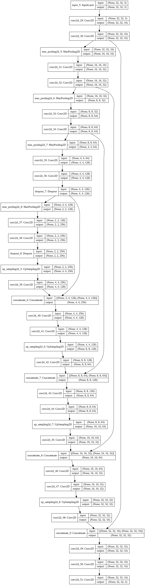
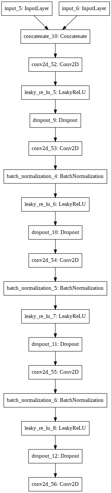
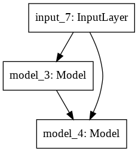

# Modified Pix2Pix

Reimplementation the Pix2Pix model for a small dataset with less parameters and different Patch-Net architecture

Google Code[Tensoflow]: https://github.com/tensorflow/docs/blob/r2.0rc/site/en/r2/tutorials/generative/pix2pix.ipynb

U-Net:

Patch-Net:

Pix2Pix:

