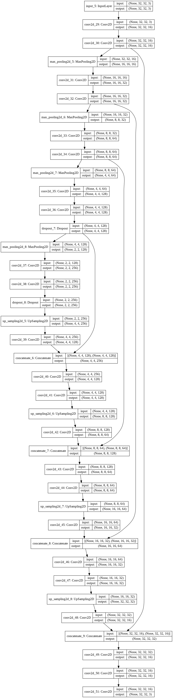
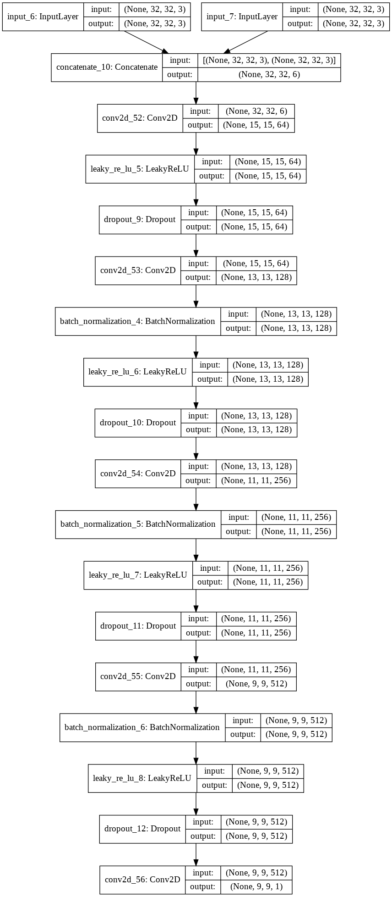
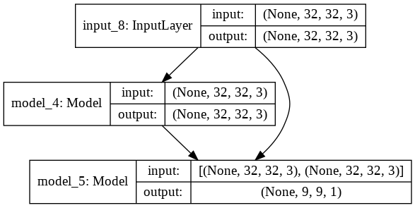

# tiny-pix2pix

Tiny Pix2Pix is a compact PyTorch re-implementation of the pix2pix image-to-image translation model designed for small images such as CIFAR-10. The project provides a lightweight U-Net generator, a PatchGAN discriminator, and a training pipeline that follows modern PyTorch best practices.

## Getting started

### Installation

Create and activate a virtual environment, then install the project dependencies:

```
pip install -r requirements.txt
```

If you already have PyTorch and torchvision installed, you can skip reinstalling them by running:

```
pip install -r requirements.txt --no-deps
```

### Training

The training script downloads CIFAR-10 automatically and trains the Tiny Pix2Pix model by pairing each image with itself, replicating the behaviour of the original demonstration script:

```
python train.py --epochs 5 --batch-size 8 --dataset-root ./data --device cuda
```

Model checkpoints are stored in the `models/` directory by default. Use `python train.py --help` to inspect all available options.

## Important links

- [Original paper](https://arxiv.org/abs/1611.07004)
- [Project page](https://phillipi.github.io/pix2pix/)

## Model Architecture

### Generator

U-Net: The generator in pix2pix resembles an auto-encoder. The Skip Connections in the U-Net differentiate it from a standard Encoder-decoder architecture. The generator takes in the Image to be translated and compresses it into a low-dimensional, “Bottleneck”, vector representation. The generator then learns how to upsample this into the output image. The U-Net is similar to ResNets in the way that information from earlier layers are integrated into later layers. The U-Net skip connections are also interesting because they do not require any resizing, projections etc. since the spatial resolution of the layers being connected already match each other.

<p align="center">
  
</p>

### Discriminator

PatchGAN: The discriminator used in pix2pix is another unique component to this design. The PatchGAN works by classifying individual (N x N) patches in the image as “real vs. fake”, opposed to classifying the entire image as “real vs. fake”. The authors reason that this enforces more constraints that encourage sharp high-frequency detail. Additionally, the PatchGAN has fewer parameters and runs faster than classifying the entire image.

<p align="center">
  
</p>

### tiny-pix2pix

<p align="center">
  
</p>
